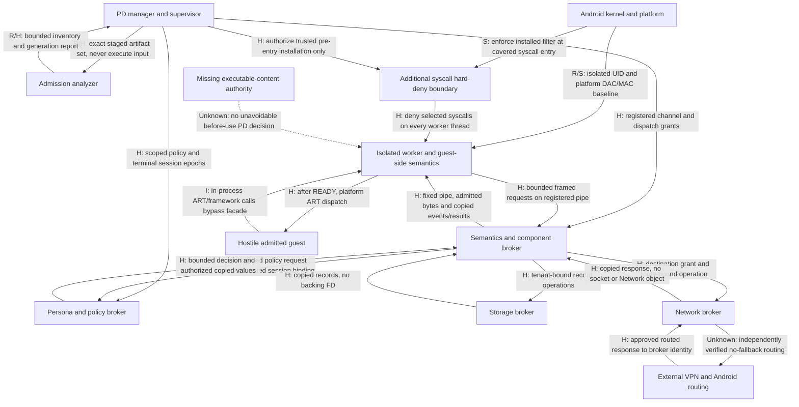

# Post-AG-1 Candidate 5 — hybrid architecture

**Candidate:** 5 of five under [ADR-0008](../decisions/ADR-0008-post-ag1-enforcement-boundary-redesign.md).
**Record prepared:** 2026-10-02. **Inherited source-evidence cutoff:** 2026-10-01.

## 1. Scope and question

Can the bounded positive mechanisms from the preceding records compose into a
mandatory authority boundary, without genuine capabilities crossing around it,
while retaining a useful Android execution class under unchanged requirements?

**Inference: the concrete platform-ART hybrid examined here does not close that
boundary.** It adds a plausible kernel owner for selected syscall denials and
places policy outside hostile memory. It supplies no unavoidable before-use
executable-content decision on the retained direct memory-loader path. Limiting
the effects of unadmitted code does not admit it. Genuine cached framework state
is a separate unresolved problem even if every proposed syscall denial works.

This is the final individual candidate record, not the comparative synthesis or
owner handoff. It selects no overall ADR-0008 exit. No prototype, experiment,
Android/runtime/test/workflow/dependency change, source integration, engine
selection, product-scope reduction or requirement amendment is included.

**R — baseline:** fetched main is
`d0302455c17eb521f68d8c4f08263af249fc3683`, tree
`a65a08589b43741eb0b775b4bec1833dd06a79dd`. The clean initial checkout was the
Candidate 4 branch with the same tree. Eight existing stashes were preserved.
A fetch denied by the filesystem sandbox was retried successfully before
accepting FETCH_HEAD. Work uses
`research/post-ag1-c5-hybrid-architecture`. Only this record and the charter's
research-progress section change.

### Evidence vocabulary

* **R — repository evidence:** preserved observations, governance and source
  findings in the linked records; original scope remains controlling.
* **S — source-supported:** official platform/kernel behavior already reviewed
  in Candidates 1–4; source support is not a new runtime measurement.
* **U — upstream claim:** reference-project claims, never enforcement evidence.
* **I — inference:** a consequence of the cited evidence, not an experiment.
* **H — design hypothesis:** proposed process, policy, protocol or proof obligation.
* **Unknown:** mandatory evidence absent or insufficient; not success.

These labels apply to every table and diagram. Unless specifically labeled R/S,
proposed mechanisms are H and their complete implementation is Unknown. The
record primarily composes C1–C4 and A/B/C evidence IDs from the ledger in section
25. No source-only finding is promoted to a runtime observation. No safety score
or requirement-satisfaction claim is made.

## 2. Prior-candidate carry-forward

| Record | Exact unchanged disposition | Contribution and limit used here |
|---|---|---|
| [C1: OS/process compartment](post-ag1-candidate-1-os-process-compartment.md) | REJECTED — NO PERMITTED MANDATORY AUTHORITY BOUNDARY | R/S: isolated UID/process baseline and selected denials; genuine Build/property state, permitted handles and direct DEX remain. An added filter does not revise C1's result. |
| [C2: controlled semantics](post-ag1-candidate-2-controlled-runtime-lower-boundary.md) | UNKNOWN — LOWER BOUNDARY NOT YET ESTABLISHED | R/S: useful package/component organization, but actual reference adapters retain genuine authority/fallback. No reference runtime is adopted unchanged. |
| [C3: constrained classes](post-ag1-candidate-3-constrained-execution-class.md) | UNKNOWN — CLASS ENFORCEMENT DEPENDS ON UNESTABLISHED LOWER AUTHORITY | R/I: a foreground utility is a useful desired class; scan-derived exclusions do not enforce it after launch. |
| [C4: syscall/Binder restrictions](post-ag1-candidate-4-syscall-binder-boundary.md) | UNKNOWN — PARTIAL LOWER-BOUNDARY MECHANISMS EXIST BUT SUFFICIENCY IS UNESTABLISHED | S: ordinary-app additional seccomp path and all-thread synchronization in inspected Android source. No complete sandbox, semantic Binder/path/content filter, race-free installation or useful app class established. |

**R:** AG-1A supports bounded artifact identity/inventory; signing rotation lineage,
actual required split completeness and hostile archive hardening remain Unknown.
AG-1B supports manager-owned generation/session decisions and a READY-before-load
sequence for a controlled fixture. Its synthetic callbacks are not normal Android
component lifecycle evidence. AG-1C's run #150 on API 35 Google APIs x86_64 debug
observed direct loader construction, resolution, initialization and entry without
the helper's grant. That Known bypass is retained, not relabeled Unknown.

PR 4 retains distinct-UID and narrow broker positives, sentinel non-access with
native absent-path rather than proven permission-denied results, and genuine
Build/Context/proc/sys/property gaps. S1 remains FALSIFIED; changing UID/profile
did not replace genuine Build values. PR 5 retains VPN-loss physical-egress,
split/exclusion/allowBypass gaps and unresolved producer/protocol coverage.

AG-1 remains **FAILED**. The historical recommendation remains **STOP UNDER
CURRENT GOALS / CURRENT ADMISSION-GATED RUNTIME HYPOTHESIS**. Tony's decision
remains **REDESIGN**. The failed ADR-0007 handoff is reference input, not the
forward architecture. Production Roadmap PR 6 remains unstarted and unauthorized.

## 3. One concrete hybrid hypothesis

**H — isolated ART worker with a static hard-deny floor and copied-data brokers:**
the manager owns immutable admission generations and policy. Each attempted
session gets a fresh, unshared regular isolated service, not a same-UID host
process slot. Trusted startup prepares only bounded resources and an anonymous
two-pipe request/reply channel to an outside component broker. Before any guest
instruction it inventories authority, quiesces pending work, removes forbidden
descriptors/mappings, and installs a final ABI-specific all-thread seccomp policy.
The guest-side semantics adapter and hostile code both live under that policy.

The proposed policy denies useful direct Binder ioctl entry, path acquisition,
new sockets and uncontrolled descriptor acquisition/replacement, child execution,
and new executable-memory transitions. It permits only the computation/memory,
threading and fixed-channel operations actually justified for the runtime.
That last allowlist is **not established**: this is a policy contract, not an
executable filter specification or tested Android configuration. No notification
listener, CONTINUE-based pointer inspection, Landlock availability, custom
SELinux domain, mount namespace or privileged supervisor is assumed.

Broker-owned storage supplies copied records; component adapters supply virtual
metadata and copied lifecycle events; Persona policy supplies bounded values;
networking, when requested, stays inside a VPN-gated network broker. No genuine
Android object, arbitrary host operation or unrestricted FD is returned for
compatibility. A trusted outside UI is considered only as a copied-event adapter;
it cannot run guest View, Activity or callback code in its address space.

| Included ingredient | Exact authority owned / not owned | Supporting evidence | Required other layer | Guest bypass and cross-layer authority |
|---|---|---|---|---|
| Immutable artifact/admission generation | Manager owns initial bytes, classification and dispatch; not every later execution | R A, B | Complete split/dependency analysis and runtime content owner | Direct loader avoids initial grant; copied bytes can become later code |
| AG-1A-style inventory | Analyzer owns reported positive findings; not proof of absent behavior | R A | Bounded hostile-input parser and conservative mandatory coverage | Obfuscation/generation evade scan-derived exclusion; report carries no execution right |
| Pre-code barrier | Manager owns session/epoch and initial release; not continued hostile control | R B | Verified boundary/handle closure before READY | Worker READY alone cannot prove policy; stale channels must not reauthorize |
| Fresh isolated worker | Android owns UID/DAC/SELinux baseline; not synthetic state or content admission | R PR4; S C1 | No shared isolated flags, forbidden handles absent | Cannot simply choose manager UID; granted FDs/deputies bypass intended data separation |
| Additional seccomp | Kernel owns installed syscall denials; not path strings, Binder semantics, cached values or DEX | S C4 sections 4–6 | Trusted all-thread installation, ABI and retained-object closure | Raw syscall cannot evade a matching denial; allowed operations and pending calls remain |
| Outside capability brokers | PD owns individual operation decisions; not all worker behavior | R PR4/PR5 bounded endpoints; H composition | Narrow transport and independent guest cutoff | Malformed messages/deputy confusion; real reply objects would bypass later checks |
| Controlled Android semantics | Adapter owns proposed virtual dispatch/metadata; not a security principal within worker | R/S C2; H redesigned adapter | Mandatory lower effects and executable authority | Direct framework/ART avoids facade; genuine Context forbidden |
| Persona/policy | Outside policy owns secret seeds and Real/Decoy/Empty/Deny decisions; not worker caches | R governing requirements; H implementation | Removal/denial of all alternate genuine-state paths | Copies reveal only authorized values but cannot be recalled; cached Build remains direct |
| Isolated storage | Storage broker owns tenant records and scoped operations; not arbitrary guest file APIs | R PR4 partial; H copied record service | No path/FD/deputy escape and transactional generation changes | Record IDs require tenant/epoch check; raw backing FD would confer durable access |
| VPN-gated network broker | Broker owns its sockets and request policy; Android/external VPN own routing | R PR5 | Independent route/no-fallback evidence for actual broker UID | Guest filter does not constrain broker; raw socket/Network grants forbidden |
| Fail-closed supervision/exclusions | Manager owns refusal and terminal epochs; not proven whole-process termination | R B partial; H | Outside termination authority and all-entry enforcement | Hostile worker can ignore local callbacks; declared exclusions are not runtime prevention |

**I:** this is a stronger composition than a hook list but still an incomplete
mandatory boundary. The rejection below concerns this concrete platform-ART
composition, not a universal impossibility proof about all future execution
techniques or the final phase outcome.

## 4. Trust and address-space partition

**H:** all trusted PD processes use ordinary app deployment. Separate named
broker processes may share PD's application UID and platform-selected app domain;
their separation is not mutual UID isolation. They are collectively TCB. The
guest gets a distinct platform-assigned isolated UID/domain. No custom UID/domain
assignment is assumed; C1's platform/OEM caveats remain. Brokers authenticate the
manager-controlled endpoint/session binding, not caller-supplied UID strings.

| Role / address space | UID/domain assumption; shares guest memory? | Secrets/state | Binder authority | Filesystem authority | Network authority | Guest-facing transport | Death/restart rule |
|---|---|---|---|---|---|---|---|
| Manager/supervisor M | PD app UID/app domain; no | Admission, policy registry, session epochs, coverage, management DB | Trusted platform orchestration only; not guest general endpoint | PD private management/import stores | Denied by proposed process configuration; no guest networking | Control of broker channel registration; no arbitrary guest RPC | Revoke all sessions; no recovery of old READY; independent termination still Unknown |
| Admission analyzer A, within M | Same M trust/address space; no guest execution | Untrusted artifact inputs, bounded reports and immutable identities | No guest API; inherits M authority | Staged artifacts only by design; M privilege makes parser TCB | No analyzer network required | Reports to M, never executable guest callbacks | Incomplete/failed analysis rejects generation; parser isolation/hardening Unknown |
| Persona/policy broker P, within M | Same M; no | Seeds, scoped stable values, mode decisions | M's trusted services for explicitly mediated Real only | Policy/persona stores | No guest traffic service | Typed internal requests from component/storage/network brokers | Death invalidates grants; corrupt state never silently regenerates |
| Guest worker W with semantics adapter | Fresh unshared isolated UID, regular isolated domain; yes | Admitted bytes, allowed copies, untrusted local state; no policy secret | Trusted startup may already have Binder; proposed post-barrier useful Binder denied | Baseline restrictions plus broad acquisition denial; no persistent raw storage FD | Direct sockets denied; no raw socket supplied | Two fixed pipe ends to component broker | Death terminal; restart uses new worker/epoch/filter, never old READY |
| Storage broker S, separate process | PD app UID/app domain; no | Tenant records and broker-owned backing objects; no seed need | Trusted internal PD control; no arbitrary provider bridge | Actual private tenant storage; same UID makes all broker code TCB | Proposed denied; retained descriptors must be audited | Typed operations via component broker, copied results | Reject old IDs/epochs; pending writes settled transactionally; no grant resurrection |
| Component/semantics broker C, separate process | PD app UID/app domain; no | Channel/session maps, virtual package metadata, dispatch state | Genuine platform objects remain here where needed | Only approved resource metadata by contract; actual same-UID power broader | Proposed denied; no service that can create uncontrolled deputy traffic | Owns pipe peer, parses bounded messages, dispatches typed operations | Channel failure terminal; cancel callbacks/jobs/tokens; no reconnect to stale session |
| Network broker N, separate process | PD app UID/app domain; no | Owned sockets, destination grants and route epochs | Connectivity observations/internal PD API; no arbitrary transactions | No guest file service; same-UID TCB privilege acknowledged | INTERNET where configured; route identity is PD app/broker, not virtual guest | Typed requests via C, copied bytes/status only | Close every owned socket; invalidate route/session; no unverified retry |
| Optional PD UI U, separate trusted process | PD app UID/app domain; no | UI state and bounded copied render/input model | Window/input/Activity platform authority retained outside W | PD UI assets only by contract | Proposed denied; no embedded WebView/network SDK | Typed events via C; no native graphics/Surface grant assumed | UI death invalidates presentation/session; restart cannot execute guest before fresh gate |
| Trusted native bootstrap helper T, inside W | Same isolated UID/domain; yes after entry | Temporary setup inventory, filter installation result; no durable secret | Only pre-entry setup, then same denial as guest | Only preparation then same final policy | No exemption from worker policy | Pre-entry handshake on registered channel | No post-entry trust in its writable state or death callback; failure prevents READY |

**I:** placing a helper in W does not protect it from hostile native memory
access. Kernel-held filter state is different from helper-held policy state.
M/P decisions and unrestricted broker authority never rely on guest memory for
integrity. A broker compromise would reach PD authority; the graph below does
not imply brokers are isolated from each other merely because they have PIDs.

## 5. Proposed pre-entry sequence

No step below has been run as this hybrid. **R** means only the named predecessor
demonstrated a bounded part. Every mandatory Unknown prevents Protected READY.

| Order | Owner and proposed operation | Evidence state / failure rule |
|---|---|---|
| 1 | M identifies exact base/split set and stages unchanged artifacts | R A bounded supplied-set identity; actual required completeness Unknown; missing mandatory identity rejects |
| 2 | A establishes content hashes, signing/dependency/DEX/ELF/component inventory | R A partial; rotation lineage, opaque dependencies and parser hardening Unknown; no negative-scan proof |
| 3 | M creates immutable generation binding artifacts, analyzer/runtime/policy/evidence versions | R A/B scoped identity; H expanded binding; changes invalidate prior authority |
| 4 | M selects desired execution class against positive enforcement evidence | H; no Protected class established here, so real Protected flow stops now |
| 5 | M requests a fresh unshared isolated W; only trusted PD/platform startup | R B/C1 instance pattern; H all-entry guarantee; no guest providers/classes/native constructors yet |
| 6 | C establishes two anonymous one-way pipes through trusted startup transfer and registers their peer/session ownership | H transport, not inherited B's runtime Binder proof; partial setup closes session |
| 7 | T inventories every thread, descriptor, Binder state, pending operation, native library and mapping | S C4 explains preexisting ART/Binder; complete inventory/quiescence Unknown |
| 8 | T removes forbidden FDs/handles and mappings; prepares only immutable data resources; disables unsupported subsystem entry | H; genuine caches and property areas cannot be assumed removable; failure blocks |
| 9 | T sets no-new-privileges and installs final hard-deny seccomp across all W threads | S C4 ordinary-app/TSYNC source path; require exact success 0, not any nonnegative return; device installation untested |
| 10 | M receives trusted pre-entry setup evidence and checks independently where possible | H; kernel mode flag/worker report alone cannot attest exact all-thread policy or drain pending calls; independent complete check Unknown |
| 11 | M/C bind worker identity, immutable generation, policy epoch and channel endpoints; all brokers register that binding | R B analogous Binder-observed binding; H pipe equivalent; numeric UID/PID reuse never enough |
| 12 | M authorizes READY only with all mandatory prerequisites established; C activates narrow operation grants | R B controlled barrier concept; H full boundary. It must remain denied for this candidate |
| 13 | M releases exact admitted executable bytes as copied data over prepared channel; W loads and initializes only afterward | R B before-byte/load ordering; H pipe transfer and semantics. No guest code or native initializer earlier |

C4's source supports filter inheritance for newly created threads/tasks and
TSYNC synchronization, not cancellation of syscalls already entered. Pending
Binder reads/replies or descriptor transfers could complete after installation.
Closing a libbinder FD while other threads use it is not a proven drain protocol.
There is no evidenced race-free ART quiescence procedure in this hybrid. Readiness
sent after guest entry, or successful `PR_GET_SECCOMP`, cannot fill that gap.

## 6. Authority ownership graph

Every edge names an authority or bounded flow. **R/S edges describe limited
predecessor/source support, H edges are proposed, and Unknown edges are missing
proof obligations.** No whole graph is proven. In particular, the syscall box is
not an executable-content owner.

Optional U receives copied render descriptions through C and returns copied
input events under the same H contract. It retains window/lifecycle tokens.
No edge grants a guest callback execution in a trusted address space.

## 7. Cross-layer capability ledger

**H/I:** this includes proposed permitted transfers and forbidden objects that
could arrive through startup, replies or callbacks. A broker origin is not a
safety property. “Revocable” concerns further use, never erasure of disclosed
bytes. Duplicability describes the underlying capability even where policy would
forbid duplication. Evidence is C1/C2 handle analysis and C4 sections 5–12 unless
otherwise identified; complete hybrid closure is Unknown.

| Source layer | Destination | Object/capability | Authority transferred | Duplicable? | Revocable? | Outlives broker/session death? | Guest misuse path | Required mitigation | Evidence state |
|---|---|---|---|---|---|---|---|---|---|
| Platform/C | W | Binder object | Calls to referenced service under platform checks | References transferable where permitted | Not by dropping C's reference | Yes for other live services | Raw transact, nested reply objects | No useful direct Binder after barrier; no forwarded object | S C1/C4; drain Unknown |
| M/S/C | W | File descriptor | Actual file/device/socket operations and mapping rights | Yes through dup/transfer/inheritance if allowed | Closing source copy insufficient | Yes | Read/write/mmap outside broker checks | Only fixed pipe ends; close other FDs and block all acquisition/replacement routes | S C4; closure Unknown |
| M/C | W | Shared memory | Read disclosed pages; possible writes/aliases | Mapping/FD copies possible | Existing mappings/data not recallable | Yes | Mutate checked bytes or inspect genuine state | Prefer copied pipe data; no live writable shared region; any future immutable grant needs alias proof | R B readonly transfer only; H stricter transport |
| C | W | Pipes/socketpairs | Message channel to deputy | FD duplication possible | Peer closure ends exchange only after buffered data/holders accounted | Buffered bytes/copies can survive | Forge requests, retain copies, redirect endpoint | Choose two fixed anonymous pipes; no endpoint rebind, duplication, FD import or silent reconnection | H; exact Android setup Unknown |
| N/platform | W | Socket | Egress/read/write and route-dependent authority | Yes | Source close insufficient | Yes while another copy lives | Generic write avoids socket-creation checks | Keep socket exclusively in N; deny transfers and inherited sockets | R PR5 ownership positive; S C4 |
| N/platform | W | `Network` object | Network selection/socket-binding operations subject to OS checks | Object/value can be copied | Route lifetime differs from PD policy lifetime | Potentially | Select physical network or factory | Return synthetic metadata only; never usable platform Network | S C2/P4; no unrestricted authority assumed |
| Provider/S/N | W | ParcelFileDescriptor | Transferable underlying FD | Yes | Wrapper close is not global revocation | Yes | Detach/dup/use underlying object | Reject descriptor-bearing replies; copied data only | S Android API; hybrid Unknown |
| C/platform | W | Content/provider handle or cursor | Queries, URI grants, cursor windows, FDs | References/grants may persist | Mechanism-specific, no universal recall | Possible | Arbitrary URI/openFile or nested handle | Broker finite virtual operations; no host resolver/provider/cursor capability | R/S C2; H |
| P/C/GMS | W | Account/GMS handle | Account/session/token or remote-service authority | Often copyable; exact service-specific | No generic PD revocation | Possible, especially remote token | Host account/token fallback or remote network deputy | Exclude genuine handles and general GMS bridge; Empty/Deny by policy | R/S C2 positive unsafe reference path |
| C/platform | W | Package-manager object | Genuine query/resolve or service access | Reference copies | Not controlled by PD facade deletion | Yes if system remains | Discover host universe through original manager | Return virtual metadata records only | S C1/C2; caches Unknown |
| S | W | Storage handle | Proposed logical record operations; raw FD would widen to backing object | ID copyable | Yes only with per-operation outside epoch checks | Old ID persists but must be unusable | Cross-tenant/stale ID, path traversal | Server binds ID to channel/tenant/generation/op; no path-as-authority | H; PR4 narrow identity precedent |
| Platform/M | W | Mapped file | Read genuine bytes or execute existing mapping | Aliases/copies possible | Unmap one alias cannot recall all | Yes | Read property pages/code/resource host metadata | Inventory all aliases before entry; only admitted data; cached genuine-state closure missing | S C1/C4; Unknown |
| M/C/input | W | Executable bytes | Potential ART/native execution, beyond inert transport | Yes, ordinary data copies | Not after execution/copy | Yes | Treat copied data as DEX via direct loader | Unavoidable before-use admission required; absent | R C Known bypass; I composition failure |
| C/platform | W | Callback/event | Future entry and possibly nested capabilities | Data/token replay possible | Outside epoch can reject future dispatch; cannot undo completed event | Queued events possible | Execute before READY or run guest callback in C | Copied bounded events; gate every delivery; guest callback executes only W | R B synthetic order; H real lifecycle |
| C/platform | W | PendingIntent-like durable token | Deferred action under creator authority | Bearer token often transferable | Creator cancellation depends on type/races | Can outlive creating process | Trigger stale privileged action after revocation | Keep real token in C; expose epoch-bound logical ID only | S C2/C4; full cancellation Unknown |
| C/U/platform | W | Lifecycle token | Task/window/component identity and future dispatch | References may be copied | Platform lifetime not PD epoch | Possible | Cross-session launch/restart/window operation | Never raw platform token; typed virtual event ID rechecked outside | H; UI compatibility Unknown |

The ledger forbids both raw authority and serialization that recreates it: a
Parcelable, nested object, URI grant, token string or integer descriptor is not
“copied data” if an outside service later accepts it as authority. Nonsecret
logical IDs are meaningful only together with the broker's own session binding.

## 8. Guest-to-broker transport

**H:** two pre-established anonymous pipes are the selected conceptual transport.
They carry a small typed protocol: fixed version, bounded length, opcode, request
sequence and copied payload. C associates the pipe itself with a manager-created
session/epoch, serializes requests, caps queues/timeouts and rejects malformed,
oversized, stale, duplicate or unknown operations. Message-provided identity is
never authoritative. P/S/N recheck C's trusted session binding and current policy.

This is a credible *transport hypothesis*, not a proven Android implementation.
The historical identity evidence used Binder and cannot be transplanted to pipes
as a passed test. Pipe endpoint possession identifies a channel only if all
copies, transfers, descendants and cross-session acquisition are closed.

| Option | Required syscall surface | FD acquisition/duplication/authority risk | Framing and identity | Deputy/endpoint replacement risk | Broker death and assessment |
|---|---|---|---|---|---|
| Pre-established pipe pair, selected H | Pre-entry pipe/pipe2 and transfer; post-entry read/write, bounded poll/ppoll or equivalent, close; runtime futex/signal needs separately inventoried | No ancillary-FD payload on ordinary pipe reads; dup/fcntl duplication, Binder transfer, proc reopening, inherited writers and alternate FD acquisition still must be denied | Explicit bounded byte-stream frames; C's endpoint registry supplies identity, not bytes claiming UID | Reject guest-selected host operations; immutable endpoint slots require no reuse/replacement route, not FD-number filtering alone | EOF/EPIPE/timeout revoke; buffered data and retained copies can delay observation; no proof of whole-worker death. H/Unknown Android policy compatibility |
| Unix socket/socketpair | Setup socketpair; read/write or send/recv; sendmsg/recvmsg for ancillary data; poll/close | SCM_RIGHTS can inject sockets/files even with new socket creation denied; generic IO uses existing socket | Stream/packet framing still bounded; peer credentials plus generation where available, not guest assertions | No bind/connect/accept/reconnect after barrier; deny ancillary reception/sending and endpoint replacement comprehensively | Peer close does not kill computation; half-close/queued messages/copies need accounting. Plausible alternative, not selected or proven |
| Shared memory plus signaling | Setup shared-memory FD/mmap; loads/stores, futex or eventfd/pipe/poll signaling; mprotect/close as applicable | Writable aliases, descriptor duplicates and data races; never share manager secrets/control objects | Copy into broker-owned snapshot before parsing/checking; lengths/epochs are hostile | Check-then-use live memory creates TOCTOU; offsets/pointers cannot select host memory or operations | Mapping survives source close/death; lease/epoch required outside shared memory. More proof obligations; not selected |
| Narrow Binder endpoint | ioctl BINDER_WRITE_READ, driver mapping and runtime support; reply/callback processing | Same driver carries other handles and FD transfers; a “broker FD” is not one remote object | Binder-observed identity is useful, per-method/session checks remain required | Allowing useful Binder in W reopens genuine paths subject only to Android baseline; classic seccomp cannot select transaction semantics | Endpoint death can deny own calls, not other system services or copied FDs. Incoherent with selected blanket useful-Binder denial; rejected fallback |

**I:** no IPC choice supplies executable admission or cached-state removal. If
the selected pipe policy cannot coexist with ART/framework shutdown and required
semantics, that is an additional architectural blocker. Relaxing to general
Binder or an unfiltered in-process helper is not an accepted repair.

## 9. Binder strategy

**H/S:** deny useful direct Binder driver entries across every W thread using
the C4 hard-deny path; close/drain existing Binder authority before entry and deny
reacquisition. Request encodings, compat ABI and all usable devices must be
covered. Blanket ioctl denial is the proposed strongest floor until each retained
non-Binder ioctl has an independently justified object and operation policy;
no such complete policy is proven.
Classic BPF sees syscall metadata, not transaction targets or nested Parcels.

C retains any necessary genuine objects, performs finite policy-approved
operations and returns copied/synthetic results. “Proxy all interesting services”
is not the enforcement claim. Unfiltered Binder threads inside W are forbidden;
hostile native code shares their address space. The full semantic inventory is
in section 16; the authority groupings here state the Binder consequences.

| Required semantic family | Direct Binder required in ordinary Android path? | Proposed brokerage/result | Durable leak and asynchronous rule | Conclusion |
|---|---|---|---|---|
| Package/resource/configuration | PM/display queries commonly yes; local admitted data computation no | Virtual package/config records and admitted resources | No PM/Context/display object; configuration events copied and epoch checked | Safe adapter and preexisting cache closure Unknown |
| Application/Activity/AM/UI | Normal attach/window/lifecycle paths yes | Trusted outside stub retains tokens; W receives copied events | No window/Surface/device FD, no genuine Activity token; all guest callbacks remain W | Useful actual Activity semantics Unknown; direct unrestricted requirement blocks eligibility |
| Services/providers | Normal discovery/binding/publication yes | Finite virtual service/data operations, copied results | No provider Binder/cursor FD or arbitrary URI grant; asynchronous replies revalidate | Broad Android compatibility Unknown; unavailable surfaces must refuse |
| Receivers/jobs/alarms/background | Platform registration/scheduling/delivery yes | C owns registrations and real tokens; optional virtual event IDs | Stale queued delivery cannot start W without fresh gate; cancellation races unresolved | Initially excluded by desired class; reliable total exclusion Unknown |
| Persona/location/telephony/accounts | Many genuine queries yes; some cached state no | Decoy/Empty/Deny records; explicit controlled Real only | No account/session/GMS handle; no host GPS fallback; event stream copied | Query brokerage plausible, alternate/cached closure Unknown |
| Network/WebView/SDK/native helpers | Some direct effects use sockets/JNI; system/renderer service paths use Binder | Only N's approved copied byte service; no general WebView/GMS bridge | No Network/socket/renderer capability; no outside guest code | WebView/GMS excluded as intended support; technical exclusion/other deputies Unknown |

A mandatory surface that can only work by granting unrestricted genuine Binder
remains a blocker. Failing compatibility is not permission to reopen the driver.

## 10. Filesystem and storage strategy

**H/S:** combine isolated credentials, existing SELinux, descriptor/mapping
closure and broad syscall denial with broker-owned logical storage. Classic
seccomp cannot inspect path strings; an allowed dirfd does not establish subtree
confinement. No lower selective path boundary is presumed available. Policy must
cover open variants, descriptor import/duplication, mapping and alternative I/O
mechanisms, not just `openat`. C4 supplies source limits, not a complete allowlist.

| Target | Proposed protection and owner | Remaining bypass/Unknown |
|---|---|---|
| PD management state | Android isolated UID/DAC/MAC plus no broker management operation | PR4 sentinel scope is bounded; same-UID trusted brokers and parser/deputy bugs remain TCB risks |
| Peer guest state | Separate unshared W instances; S binds every record to session/tenant | Collusion, stale logical IDs and broker database authorization need evidence; persona sharing grants nothing |
| Host app state | Baseline private-data restrictions plus no host resolver/file grant | Existing FDs or overbroad Real operation defeat path isolation |
| Raw package universe | Deny new genuine path/PM access; C returns explicit virtual metadata | Installed code paths/resource metadata already mapped or cached remain Unknown |
| Genuine `/proc` | Deny all acquisition and retained readable handles, not per-path string filtering | Existing mapped/copied process information survives; permitted metadata syscalls need separate account |
| Genuine `/sys` | Same broad acquisition deny and closure | PR4 CPU path exposure not erased historically; complete OEM/device handle inventory Unknown |
| Property backing areas | No new property file access, remove forbidden mappings before guest | Already mapped property pages and cached Build values may remain necessary to runtime; no safe removal established |
| External/shared storage | Isolated baseline; S provides only explicit copied records under policy | Provider grants, PFDs and arbitrary host storage paths prohibited; full backup/transfer scope Unknown |
| Arbitrary pre-opened FDs | Inventory each object before entry; retain only fixed pipe ends and individually justified resources | FD-number allowlist alone fails on reuse, dup, queued transfer or alternatives; complete closure Unknown |
| Guest persistent local state | S owns backing files and atomic tenant transactions; W receives bounded records | Useful File/SQLite/mmap semantics without raw FDs/path opens unproven; cannot label general Android storage supported |

Admitted resource bytes may be prepared before entry, but no guest initialization
may occur then. Lazy framework resource opens after the filter can fail. If useful
storage/resources require selective direct paths whose lower boundary is
unavailable, they remain Unknown; a path-rewriting hook is not the substitute.
Copied data already disclosed cannot be revoked by deleting its source record.

## 11. Persona and framework-state strategy

**R/I:** S1 and PR4 demonstrate why credential separation alone is insufficient.
The hybrid's syscall policy acts on future kernel calls; it does not erase genuine
data already in ART, framework objects, native caches or mapped property pages.
P can own correct values without owning every place the guest reads values.

| Surface | Already cached/mapped genuine state | New Binder/syscall query | Proposed controlled result | Cannot safely remove / policy consequence |
|---|---|---|---|---|
| Build/device descriptors | Build fields and boot/runtime property-derived data possible; prior genuine equality evidenced | Property/framework paths may refresh other fields | Coherent Decoy descriptors from P | No complete pre-entry removal of genuine values established; facade bypass retains blocker |
| System properties | Bionic property areas/native caches | New backing-area open or service query | Explicit synthetic property subset or Deny | Memory reads may need no syscall; blocking new opens insufficient |
| Locale/timezone | Runtime defaults/resources may already exist | Configuration service or filesystem lookups | Coherent P locale/region/timezone | Complete cache replacement and runtime fidelity Unknown; no host fallback |
| Display/configuration | Framework display/resource state may predate guest | Display/window Binder and graphics FDs | Copied virtual configuration and UI events | Actual Activity/rendering compatibility and cached data closure Unknown |
| Identifiers/ad-tech | SDK/framework caches where initialized | Settings/service/GMS/framework paths | Scoped Decoy, Empty or Deny; Real only explicit mediation | No secret seeds or genuine ID handles in W; all alternate SDK/native paths Unknown |
| Package universe | Framework caches and mapped APK/path metadata | PM/intent/provider/path queries | C's explicit virtual universe | No general proof all raw universe observations removed |
| Telephony/network metadata | Configuration/SDK cached values possible | Telephony/connectivity Binder, native files/sockets | Coherent P carrier/SIM/local-network records | Public IP is not changed by local values; actual route evidence separate |
| Location | No host location cache may be supplied/preloaded | Framework/fused/GMS/provider subscriptions | Stable plausible Decoy, Empty or Deny | Never host GPS fallback; copied events and all old subscriptions require closure |
| Permission-dependent personal data | Any preload/cache is forbidden unless explicitly authorized | Providers/accounts/clipboard/media services | Usually Empty/Deny; policy-reviewed Real copies | Android permission is not disclosure authority; genuine object grants forbidden |
| Sensors/battery/power | Cached sticky events and native buffers possible | Services/device FDs/native paths | Coherent synthetic series or Deny | Temporal/cross-API and native closure Unknown; unsupported values never genuine passthrough |

**I:** a genuine value read before P is asked is already a mediation failure.
Post-read replacement cannot repair it. Descriptive Android Persona fields do
not change the actual API/ABI/kernel capabilities or support matrix.

## 12. Executable-content authority — decisive missing owner

**R/I:** M authorizes initial content; ART owns actual subsequent loading and
execution. The hybrid inserts no unavoidable PD content decision inside that
second authority. C4's selected syscall effects are a real lower enforcement
point, but do not satisfy PD-REQ-091. The worker's semantics adapter remains
bypassable by direct platform loading. This is the decisive untreated Known
path, not an item deferred behind compatibility experiments.

| Introduction/use | Earliest proposed PD decision | Unavoidable before use? / consequence |
|---|---|---|
| `InMemoryDexClassLoader` | Optional M helper if requested; initial grant covers initial content only | No; C historical direct bypass remains untreated; kernel sees allocations/effects, not admitted digest |
| `DexClassLoader` | A can inventory initial files; broker can refuse new file service | No complete gate; broad open denial can stop particular loads, not content-authorize every route; Unknown |
| Other DEX/JAR/APK loaders | Same initial inventory | No complete before-use owner across PathClassLoader/DexFile/other paths; Unknown |
| Generated DEX | No ordinary-byte computation decision | Cannot infer code absence from no download/native package; memory-loader admission missing |
| Encrypted/unpacked DEX | Analyzer may reject positively opaque inputs | Plaintext generated after launch needs pre-use gate; absent indicators prove nothing; Unknown |
| Reflection into loaders | No external decision on accessible in-process call | Public loader resolution need not request C; private API limits do not establish admission |
| Interpreted DEX | No content-origin predicate in seccomp | Readable bytecode can be consumed by existing interpreter; denying new PROT_EXEC pages is insufficient |
| Packaged native libraries | Initial inventory/grant must precede constructors | Mapping denial can prevent loading, but no selective all-origin admission established; desired class excludes them |
| `System.load` / loadLibrary | Inventory known call/payload, refuse optional broker load | No universal pre-JNI_OnLoad gate; target readonly rules are not PD content decisions; Unknown |
| `dlopen` | No syscall named dlopen to authorize | Underlying opens/maps can be denied; already loaded code/FDs and dependencies remain separate |
| Generated/downloaded native code | No content predicate on ordinary bytes | No-new-executable transitions are H denials; complete aliases/provenance and runtime compatibility Unknown |
| Executable mappings | Kernel may deny covered mmap/mprotect transitions by flags | Denial concerns permissions, not exact bytes; existing mappings survive; no full content admission |
| JIT/runtime-generated executable memory | Proposed broad denial of new executable transitions | May break required ART/runtime behavior; cannot selectively recognize admitted DEX by syscall metadata |

**I:** even perfect socket/file/Binder denial cannot prevent ordinary computation
from manufacturing byte arrays. If ART remains available to execute the admitted
application, there is no established class rule that excludes the direct loader
after launch. A fatal allocation failure under an overly restrictive filter would
not prove selective admission or a useful Android class.

A materially different execution technique would have to own instruction/import
semantics and executable introduction before use, protect that owner from guest
tampering, and supply safe Android adapters. A new verifier/interpreter/custom VM
is not evidenced by this composition and is not invented, selected or approved
to rescue it. Full guest Android remains outside this task. No prototype review
is proposed on the strength of an unnamed future execution technique.

## 13. Mandatory AG-1C trace

The historical observation is exactly scoped to run #150, head
`55ed5b7803608101f57f7c7a87eb9bd0a2a56634`, tree
`5fc2b17be1c23cedb2b58af8e500875426af3762`, API 35 Google APIs x86_64 debug.
There is no new hybrid execution result. The following traces its authority,
not an assertion that the unimplemented filter was tested.

| Stage | Hybrid intervention / owner | Before-use decision, bypass and consequence |
|---|---|---|
| 1. Admitted guest executing | M's initial grant and B-inspired READY; kernel proposed syscall floor | Initial grant concerns original generation; no perpetual executable authority follows |
| 2. Obtains/manufactures unadmitted DEX | N/S can deny acquisition; C copies only policy-approved data; kernel denies selected acquisition syscalls | Local computation can manufacture bytes; historical separate DEX transfer was integrity-checked, not admitted on direct route |
| 3. Directly invokes `InMemoryDexClassLoader` | ART public API, no mandatory call to M/C/P | No hybrid content intervention; guest skips facade/helper without a race |
| 4. Loader construction | ART validates/allocates/copies; kernel applies any resulting syscall policy | No PD content identity comparison. R: LOADER_CONSTRUCTED=1 historically; exact filter compatibility Unknown |
| 5. Class resolves | ART class definition/resolution; no broker required | Validity is not admission. R: CLASS_RESOLVED=1; no new mandatory PD decision inserted |
| 6. Static initializer executes | Existing ART execution machinery; syscall denials apply if effects request them | R: STATIC_INITIALIZED=1; interpretation need not create new native executable pages; after-effect kill is too late |
| 7. Entry code executes | Same isolated credentials/filter and optional broker checks as original code | R: ENTRY_INVOKED=1; restricted effects do not undo unadmitted execution under PD-REQ-091 |

**Earliest authoritative PD decision for the new bytes: none established. Owner:
missing.** ART's validity checks are platform decisions, not PD admission. The
kernel owns denied syscall effects, not the bytes' executable classification.
Controlled semantics can route cooperative calls; broker isolation can protect
manager state; neither makes the direct call traverse M. There is no timing race
to win against a decision the direct path never requests.

Steps 3–7 remain possible under the retained platform-ART authority model; their
historical occurrence remains a **Known bypass of executable admission**. Exact
incidental behavior under an unimplemented filter is Unknown and cannot be used
to downgrade that evidence. No evidenced mechanism treats the Known bypass in
the proposed class. PD-REQ-090 requires a hard stop for the affected path and
PD-REQ-091 is not met by this composition. This is not a universal Known-unsafe
classification of every Android app or every untested loader.

## 14. Native and direct-syscall model

**H:** the desired class admits necessary platform/PD runtime native code but
excludes arbitrary app-controlled native content. This exclusion is not technically
established after launch; no native-capable Protected class is supported. To avoid
hiding that gap, the table assumes hostile native instructions do execute in W.
They can tamper with W's helpers but do not thereby acquire M's address space.

| Native path | Proposed lower action / owner | Retained authority and evidence limit |
|---|---|---|
| JNI | Kernel still filters effects reached through platform/PD/guest JNI | Same-process helper is not a principal; platform native code reads existing state; S/I C3/C4 |
| Raw syscall instruction | Installed kernel filter evaluates ABI/number/scalars | Cannot bypass matching hard deny through libc/PLT avoidance; allowed effects require full review, S C4 |
| `dlopen` | Deny relevant open/executable-map transitions | Existing libraries and permitted aliases do not require a fresh content grant; complete denial Unknown |
| Native threads | TSYNC for existing threads; kernel inheritance for future permitted threads | No unfiltered helper thread; pending old syscalls and runtime thread compatibility Unknown |
| Binder ioctl | Deny useful ioctl entry across ABIs/devices/all threads | Pre-entered commands/mapped data/queued FDs require closure; no semantic transaction predicate |
| Filesystem | Baseline DAC/MAC plus broad acquisition and FD-use policy | Generic IO on retained genuine objects can still work; complete allowlist Unknown |
| `/proc` | No new acquisition and no retained proc FD | Cached maps/process metadata and alternate observations remain |
| `/sys` | No new acquisition and no retained device/sysfs FD | OEM/device exceptions and preexisting copies Unknown |
| Properties | Deny future backing access | Already mapped/cached values need no filtered syscall; known genuine-state problem retained |
| Sockets | Deny creation and unapproved use/import; no retained network socket | Generic write on leaked socket or broker/deputy traffic remains distinct |
| Inherited FDs | Pre-entry object inventory/closure and no replacement/import | Numeric allowlist has no object identity; pending transfer/dup routes Unknown |
| Shared memory | No writable shared policy/control region; copied channel data | Guest can corrupt own memory; aliases and preloaded genuine data remain risks |
| Executable memory | Proposed deny new executable protection transitions | Existing code/code reuse and interpreted DEX survive; ART/JIT compatibility Unknown |
| Child processes | Deny fork/vfork/exec and unneeded clone variants; justify any thread-only subset per ABI | clone3 pointed-to flags cannot be inspected by classic BPF; system-created components need new barrier, not inherited filter |

**I:** any permitted native execution remains under matching kernel denials, but
complete arbitrary-native containment requires closing every retained direct and
deputy authority. That has not been established. Static absence of ELF or a
“Java-only” label does not enforce exclusion. ByteHook/ShadowHook are optional
observation/interception ideas only, never the authority owner; neither is
integrated or needed to justify this candidate's disposition.

## 15. Networking

**Require VPN for protected apps = ON. No Privacy Decoy VpnService.** All broker
operations need current policy and independently justified external routing;
unverifiable required VPN/route state blocks execution/traffic. There is no
physical-network fallback. No actual network support is established here.

| Potential traffic producer | Direct socket authority / guest seccomp effect | Broker/deputy and Android routing identity | External-VPN requirement / loss-change behavior |
|---|---|---|---|
| W guest worker | Baseline isolated limits plus H hard deny and no socket FD | May request N only through finite C protocol; isolated UID is not virtual package identity | No direct traffic permitted; invalidate session on required route failure; all alternative deputies Unknown |
| Component broker C | Proposed INTERNET denied; W filter does not cover C | Genuine service calls can cause external traffic under service UID | No network-producing call unless producer/route separately verified; deny/cancel on loss; permission denial alone insufficient |
| Optional UI U | Proposed denied, no browser/network SDK | Window/services are separate deputies, PD app UID | Any newly identified producer blocks class until scoped; no outside network fallback |
| WebView if allowed | Not allowed in desired class; provider/renderers outside W may have sockets/JIT | Renderer/provider processes have platform-managed identities | No inclusion without full independent attribution/routing and startup evidence; W filter cannot be assumed inherited |
| SDK/helper processes | Excluded unless every effect is in admitted closed class; W filter applies only to W/inheriting tasks | Remote or system-created helper has its own actual UID | Unknown producer means no Protected admission; fresh boundary and routing proof required |
| Network broker N | Deliberately owns sockets; W filter has no effect on N | Actual PD application/broker identity determines per-app VPN routing, not logical guest | Verify route generation and external no-fallback dependency; on change close sockets/revoke grants, block new sends; atomic cutoff remains Unknown |
| GMS if allowed | General GMS bridge excluded; W filter does not constrain GMS | Genuine GMS can act/network under GMS identity | No unverified account/service deputy; exclude rather than assume PD's VPN covers GMS |
| Secondary/background processes | Direct children would inherit filter if permitted; desired class denies process expansion | Android-launched components start with platform baseline and their actual identities | Every entry requires fresh admission/boundary/route gate; stale job/notification cannot restart weaker |
| Manager/storage/Persona roles | No guest traffic service and proposed network denial | Same-PD-UID TCB or external service effects still need inventory | Any optional management traffic separately attributed; cannot smuggle guest operation outside N |

**R/I:** PR 5 already found physical egress during non-lockdown VPN loss despite
callback/snapshot checks. Moving sockets into N does not close that race.
Externally enforced lockdown helped only in its tested scope; ordinary product
verification and full destination/identity coverage remain Unknown. The hybrid
adds no evidence for IPv6 completeness, general DNS/resolver behavior, TCP/UDP
coverage beyond historical probes, QUIC/Cronet, helpers or background routing.
No raw socket, PFD, Network object or arbitrary service tunnel reaches W.

## 16. Complete Android-semantics matrix

All proposed support is **H**, evaluated against R/S C1–C4. “Exclude” is desired
policy, not a claim of safely enforced Unsupported status. No row is a passed
compatibility or Protected test. Ordinary Binder needs and asynchronous handling
are detailed in section 9; no genuine-host fallback is accepted.

| Surface | Where semantics execute | Authority owner | Required guest capability | Brokered operation | Returned capability type | Lower-boundary effect | Persona implication | Compatibility Unknown / support conclusion |
|---|---|---|---|---|---|---|---|---|
| `Application` | Guest constructor/attach/onCreate in W after READY | M dispatch; ART execution | Admitted classes and minimal context facade | Metadata/config requests through C | Copied records | Direct framework/Binder unavailable by H | No genuine Context; caches unresolved | Synthetic B ordering only; full support Unknown |
| Activities | Guest logic in W; trusted presentation in U | C/U lifecycle; platform windows | Copied input/render events only | Task/display/window adapter outside W | Virtual event IDs, no real token/Surface | Blanket Binder/device denial breaks ordinary path | Virtual display/config needed | Useful actual Activity semantics Unknown |
| Services | Desired excluded guest registration; any guest logic stays W | C dispatch/platform registration | No genuine service Binder | Refuse or finite virtual operation | Copied result only | Direct Binder denied by H | No host service fallback | Reliable exclusion/all bind paths Unknown |
| Providers | Desired excluded guest/provider integration | C/S typed data decisions | No resolver/provider/cursor FD | Finite virtual record queries only | Copied rows | Direct provider Binder/FD paths denied by H | Empty/Decoy/controlled Real only | Full URI/cursor and early initialization Unknown |
| BroadcastReceivers | Desired no background entry; optional copied foreground events in W | C epoch gate | No real registration token | Sanitize/gate delivery | Copied event | Direct registration denied; queued startup work unresolved | No genuine sticky-state passthrough | Safe exclusion/order Unknown |
| Jobs | C would own real scheduling; desired excluded | M/C every dispatch | No scheduler Binder | Refuse scheduling | Denial/status | No direct scheduler; system restarts separately gated | No stale persona event | Cancellation/reboot/exclusion Unknown |
| Alarms | C would own real alarm tokens; desired excluded | M/C | No PendingIntent | Refuse scheduling | Denial/status | Direct Binder denied; retained token closure required | Epoch/rotation consistency | Safe exclusion and token races Unknown |
| Resources | W consumes pre-admitted data; U renders own model | M artifact set, C configuration | Copied immutable bytes; no host asset path | Finite resource/config requests | Data, no raw system asset FD | Open/map denial breaks lazy ordinary loads | Synthetic config must be coherent | Layout/drawable/asset fidelity Unknown |
| Base/splits | M/A validation; W only selected admitted content | M generation | Exact immutable set | Import and resource delivery | Bytes/metadata | No post-entry arbitrary path opens | No host package-path universe | Required completeness/signing lineage Unknown |
| Multidex | ART in W after initial authorization | M initial grant; later owner missing | Initial admitted DEX set | Initial copied transfer | Executable bytes | Syscall filter lacks DEX-content policy | Same mandatory state restrictions | Initial loading plausible; later loader Known gap |
| Package manager | Virtual metadata in C; guest facade W | C virtual universe | Typed queries only | Bounded virtual resolve/query | Copied package records | Genuine PM driver path denied by H | Never host/peer fallback | Alternate caches/intent behavior Unknown |
| ActivityManager | Genuine adapter in C/U; virtual dispatch in W | C/platform | No real AM token | Finite lifecycle operations | Copied events/virtual IDs | Guest attachment/callback compatibility may break | No real service metadata disclosure | Complete safe adapter Unknown |
| WebView | Desired excluded; platform provider/renderer not admitted | Missing complete subsystem owner | None permitted | Refuse | Denial | Direct Binder/socket/JIT denials reduce paths, not complete proof | No provider/device/account fallback | Runtime exclusion and useful support unproven |
| SDK initialization | Admitted local library code in W only | M pre-entry gate; effect owner per operation | No excluded dynamic/native/deputy effect | Same finite broker protocol | Copied values | Every effect shares W policy; remote SDK outside it forbidden | SDK paths need independent coverage | Scan absence insufficient; dependency closure Unknown |
| GMS | Desired excluded genuine bridge | C denies; external GMS owns genuine service | No real GMS/account token | Empty/Deny or finite synthetic metadata | Data/status only | Direct Binder denial required | No host accounts/IDs/location | Complete no-GMS enforcement Unknown |
| Native initialization | Trusted platform/PD before guest; guest native excluded | Kernel effects; content owner missing | Necessary runtime JNI only intended | No arbitrary library-load service | No library handle | New executable transitions denied by H | Existing native state still genuine | Selective provenance/exclusion Unknown |
| Storage | S persistent records, W local copies | S tenant/epoch/policy | Typed record operations | Copy read/write/transaction | Revocable logical ID plus data | Broad file denial; no backing FD | Persona does not share storage | File/SQLite/mmap compatibility Unknown |
| Package visibility | C virtual graph and W facade | C, with missing cache closure | Bounded metadata queries | Virtual-only enumeration | Copied records | Path and Binder acquisition denied by H | No persona-implied visibility | All raw observations Unknown |
| Binder/services | C retains real services; W none useful | Kernel deny plus C request checks | Fixed pipe only | Named finite operations, not transact | Copied results | All-thread driver cutoff untested | No unhandled genuine reply | Preexisting/pending closure Unknown |
| Secondary processes | Desired excluded; replacements M-created | M/platform and kernel | No process expansion | Refuse or new independently gated session | No process/FD authority | Direct child deny; platform child no automatic inheritance | New session cannot inherit stale persona grant | Comprehensive exclusion/teardown Unknown |
| Background work | W threads only while valid foreground session; external entry excluded | M/C epochs, kernel inherited policy | Runtime threads as justified, no unrestricted helpers | Foreground finite events only | Copied events | Thread support/quiescence and whole-execution stop unproven | Pause/restart must preserve policy consistency | No proven safe foreground-only class |

## 17. Useful execution class

**No useful Protected Android-app class is identified as supportable by this
hypothesis under unchanged requirements.** The most useful desired class is
C3's fixed-artifact foreground utility with Application, Activities, resources,
admitted multidex/splits and per-instance local state, excluding app-native,
WebView, GMS, subsequent code and background/process expansion.

That is not an established class: its “no subsequent code” rule lacks an owner,
framework caches expose genuine state, and UI/storage adapters may require
authority the hard-deny floor removes. A copied-input computation worker is
conceptually plausible but cannot silently replace imported Android applications
or waive PD-REQ-091. No real APK is newly classified eligible by this record.
Actual scope reduction would require an owner decision and is not authorized.

## 18. Fail-closed lifecycle state machine

**H:** terminal revocation lives outside W. No state below is an implemented
hybrid guarantee. The actual Protected path stops before Prepared/READY because
mandatory prerequisites are missing. Events apply also during intermediate setup.

| Transition/state | Authority owner | Mandatory evidence | Stale generation / failure behavior |
|---|---|---|---|
| Imported → Analyzed | M/A | Exact immutable set, bounded inventory and explicit Unknowns | Artifact change starts new generation; partial analysis cannot authorize |
| Analyzed → Rejected | M | Known bypass/incompatibility or absent mandatory evidence | Known bypass hard stop, no Experimental override; Unknown is not Protected |
| Analyzed → Prepared | M | Evidenced class, broker contracts, valid policy/consent where applicable | Not reachable as Protected here; old admission never inherited |
| Prepared → Boundary installed | T installs, kernel enforces, M checks | Complete thread/FD/mapping/pending-work inventory and exact filter success | Any incomplete installation terminates setup; no weaker fallback |
| Boundary installed → READY | M/C | Independent setup evidence, current session, all broker and VPN prerequisites | Old READY/channel/UID cannot authorize replacement |
| READY → Running | M releases bytes; W executes | Exact approved content and before-first-instruction ordering | Stale epoch denies release; arbitrary later executable owner still missing |
| Running/READY → Revoked | M/P/C/N on invalidation | Terminal epoch, rejection of requests, close broker resources and stop dispatch | Revocation cannot retract copied data or kill code by itself |
| Revoked → Terminated | Outside supervisor/platform | Independent death of every capability holder; canceled pending operations | Complete hostile termination authority/evidence Unknown; never rely on W death callback |
| Terminated → fresh Imported/Analyzed session | M | Revalidation and entirely fresh process/channel/filter/epoch | No direct jump back to Running; retries bounded, failure stays blocked |

| Event | Required owner response | Specific unresolved enforcement |
|---|---|---|
| Manager death | C/S/N deny on lost control/lease, close owned resources; outside termination of W | Anonymous-channel EOF cannot guarantee computation stops; manager-independent termination Unknown |
| Any broker death/hang | M revokes entire dependent session; outstanding work denied/canceled; no substitute wider broker | Last peer/copy and timeout behavior, partial side effects and hostile-code stop Unknown |
| Guest death | M/C revoke epoch, release resources, cancel queued deliveries | Old IDs/callbacks/UID reuse never revive grants; full descendant census Unknown |
| Process restart, reboot or system-created component | Fresh pre-entry analysis/session/boundary for any permitted entry; otherwise refuse | Platform baseline is not old PD filter; no automatic safe restart assumed |
| App update or split/dependency change | Atomic new generation, invalidate old admission/consent; stop affected execution before replacement | Complete-set validation and safe data rollback Unknown; failed update preserves old stored state without weakened execution |
| VPN loss/change or unverifiable route | N blocks new work, closes all sockets, M revokes dependent execution | PR5 race/external enforcement gap remains; observing callback is not atomic packet cutoff |
| Discovery of new executable content | Stop before use pending content decision; opaque introduction is mandatory Unknown | Direct loader lacks discovery/decision owner; after-use classification cannot repair failure |
| Known-unsafe behavior discovered | M hard-stops affected execution and revokes capabilities; no Experimental option | Independent timely termination not established; normal teardown is insufficient |
| Policy/Persona change, rotation or corruption | Invalidate grants transactionally; no silent regeneration or real-value fallback | Pending callbacks/copied values and complete epoch transition need evidence |

## 19. Confused-deputy analysis

All rows are **H/I** attacks on the proposed brokers. Authentication is necessary
but insufficient: a correctly identified guest still has no authority to choose
an arbitrary host operation. No operation accepts guest code, pointers, class
names or reflection targets for execution in a trusted process.

| Broker / hostile request | Authority the broker could misuse | Required outside decision and bounded reply | Remaining question |
|---|---|---|---|
| S: arbitrary path | PD management/peer/private filesystem | Tenant-bound logical record operations, no raw path/open proxy, copied bounded records | Traversal, aliasing, race and backup/transfer proof Unknown |
| C: arbitrary Binder transaction | PD UID's genuine service privileges | Finite typed operation allowlist and policy; never raw handle/transaction/Parcel forwarding | Full required semantic method inventory Unknown |
| C/S: arbitrary provider URI | Host data, URI grant, cursor/PFD | Map virtual data operation to explicit policy; no host URI or returned provider capability | Nested replies/cursor windows and async closure Unknown |
| N: arbitrary network destination | Egress under broker/VPN identity, local-service reachability | Explicit destination/protocol policy, validated resolution/redirects, route epoch, bounded copied response | Product network contract/independent no-fallback evidence Unknown; no open proxy presumed |
| C: arbitrary package query | Host/peer installed-package universe | Query only session's virtual universe; miss returns synthetic absence/denial | Transitive intent/SDK/cached metadata closure Unknown |
| P/C: arbitrary account/GMS operation | Host account/token/session and remote network deputy | No general bridge; Empty/Deny or separately evidenced finite policy operation | External token/deputy closure not established |
| Any broker: arbitrary FD acquisition | Durable file/socket/device capability | No FD-return opcode; validate nested result schema, retain real object server-side | Pre-entry exceptions and serialization audit Unknown |
| M/A/C: arbitrary native/library load | Execute guest code with trusted broker authority | Analyze bytes as data only; no guest-selected load/reflection/callback execution | Hostile parser/resource handling and dependency TCB review required |
| C/U: arbitrary lifecycle token use | Launch/task/window/deferred action under PD identity | Server-owned real tokens; nonsecret logical IDs checked for tenant, epoch, operation and current READY | Replay/cancel/restart races Unknown |
| P: arbitrary Persona/Real request | Seeds, genuine personal data, cross-app correlation | Never export secrets; allow only authorized scoped value and current mode | All real and alternate-value paths need evidence |

Bounds, timeouts, queue limits and allowlisted error categories are part of each
contract. A broker that silently retries a denied operation with host Context,
genuine accounts or a wider endpoint would be uncontrolled host fallback.

## 20. Required 15-row authority matrix

| Boundary | Enforcing mechanism | Owner | Guest bypass analysis | Evidence/category/scope | Cross-layer dependency | Remaining Unknowns |
|---|---|---|---|---|---|---|
| Executable-code authority | Initial M grant; no mandatory later content gate | M initially; ART executes without PD predicate | Direct memory loader avoids helper | R C API35 Known bypass; S C3/C4 ART; I untreated composition | Separate unavoidable content owner absent | Other loaders and replacement execution technique; Known path not downgraded |
| Framework/Java | Proposed facade plus future syscall denial | C/P for requests; Android/ART for direct state | Cached Build/properties and public loaders avoid facade | R PR4/S1; S C1; H adapter | Pre-entry genuine-state exclusion | Complete cache removal and coherent useful semantics |
| Binder/services/providers | Proposed all-thread useful-ioctl deny; C finite operations | Kernel plus outside C | Pending commands, genuine reply objects, alternate ABI/device | S C4; no new driver-cutoff run | Drain/FD closure, narrow pipes, safe semantic adapter | Runtime survival, complete callback/reply graph |
| Native/JNI | UID/MAC and proposed kernel denials | Android/kernel | Matching denial mandatory; allowed code/memory/deputies remain | R PR4 bounded JNI; S C4; H policy | All-thread setup, content and retained-object closure | Arbitrary native containment and exclusion |
| Direct syscalls | Additional classic seccomp hard deny | Kernel, configured pre-entry by T | Raw instruction still filtered; permitted metadata/effects outside denial | S C4 exact AOSP/common-kernel scope | ABI-complete policy and no unfiltered thread | OEM installation, complete allowlist/pending work |
| Filesystem | UID/MAC, broad open/acquisition denial, no raw broker grants | Kernel and S | Existing FD/alias or broad deputy bypasses path intent | R PR4 partial; S C1/C4; H | Descriptor closure plus copied storage/resources | Useful path-free Android APIs; alternate acquisition |
| `/proc` | Broad new acquisition deny | Kernel | Retained descriptor/memory and alternate process queries | R PR4 accessible self maps; H additional denial | Pre-entry inventory | Complete native/ABI/OEM observations |
| `/sys` | Broad acquisition/device denial | Kernel | Existing FD or copied hardware data | R PR4 CPU sysfs positive; S C4; H | Device/mapping closure | OEM surfaces and runtime compatibility |
| Properties | Deny new backing access; synthetic P values | Kernel for calls; P for copies; no cache owner | Mapped property memory/cached Build bypass syscall policy | R PR4/S1; S C4 property source | Genuine-state elimination before entry | Safe removal not established |
| Networking | Direct worker deny; N-owned requests; required external VPN | Kernel/N plus Android routing and external VPN | Leaked sockets/deputies or broker route race | R PR5 Known Gaps; S C4; H composition | Every producer/UID attributed, independent no-fallback enforcement | VPN verification, protocol/route/loss completeness |
| Storage | S tenant/epoch operations with copies; baseline private-data restrictions | S and Android/kernel | ID confusion, retained backing FD, alias or broker bug | R PR4 sentinel scope; H general service | All FD/path/deputy closure | Persistence, transactional update/removal/backup |
| Lifecycle/components | M READY and terminal epochs; C/U adapters | M/C/platform | Earlier initialization, queued callback, system-created replacement | R B synthetic sequence; S C4 startup; H | Fresh boundary for every entry and outside termination | Real app lifecycle and hostile death/restart |
| Management isolation | Separate isolated W UID/memory; outside M/P and broker checks | Android/kernel plus PD TCB | Broad deputy/FD/Context crosses isolation; W helper mutable | R PR4 identity/sentinel and B; H composition | Narrow protocol and trusted broker/source closure | Complete secrets/peer isolation and parser attacks |
| Dynamic code | Optional helper and mapping denials; content owner missing | ART/platform; M helper optional | Generated/interpreted DEX reaches direct loader | R C Known bypass; S C3/C4; I | Before-use content authority, not just effect restriction | Untested native/opaque routes; no Protected class |
| Third-party TCB | No integration; provenance and explicit reuse gate | PD governance/platform vendors | Reference hooks/claims supply no confinement | R catalog/ADR; U separated | Future analyzer/bootstrap/broker/runtime audits | Exact future dependencies, maintenance and independent review |

## 21. Evidence-closure matrix

This is a missing-evidence ledger, **not a future prototype plan or authorization**.
No individual experiment below could by itself repair the logical executable
owner gap. Physical/release evidence means the unchanged platform matrix: API
31–37 investigation, ARM64 non-rooted release-equivalent devices, Google/AOSP,
Samsung and another OEM scoped separately; debug x86_64 is not release evidence.

| Obligation | Existing positive evidence | Existing negative evidence | Source-only evidence | Missing experimental evidence | Physical/release evidence still required | Independent-review requirement |
|---|---|---|---|---|---|---|
| Pre-code ordering | R B controlled READY and exact bytes | Full component/native ordering not established | S C4 preexisting ART/Binder startup | Complete all-entry sequence before any guest initializer | Each actual startup/restart/configuration | Android lifecycle and trust partition review |
| All-thread syscall policy | No PD installation run; B only ordering concept | Pending operations not canceled by TSYNC | S C4 synchronization/inheritance/NNP | Exact policy on all existing/future threads with pending-work closure | Kernel/backport/ABI/OEM-specific install behavior | Kernel/native concurrency review |
| Direct syscall denial | R PR4 selected baseline non-access | PR4 allowed proc/sys/property observations | S C4 hard-deny metadata enforcement | Valid raw-call controls and complete retained surface | Physical ARM64 and supported compat ABIs | Native policy completeness review |
| Binder closure | R narrow broker authorization | C1 genuine handles; C2 fallback/source paths | S C4 ioctl metadata and driver model | Drain/deny all direct entries without required semantic escape | OEM driver/service/startup behavior | Binder/reentrancy/reply graph review |
| FD/handle closure | R B immutable transfer; PR5 retained sockets | Copies/mappings/deferred authority not globally revoked | S C1/C2/C4 FD/object semantics | Complete inherited/pending/duplicated/reused object ledger | Runtime/device-specific descriptor inventory | Capability protocol and revocation review |
| Storage | R PR4 sentinel unchanged/non-access | Complete native/peer/storage APIs absent | S C1 isolated policy; C4 path-filter limits | Broker tenant/persistence/deputy/atomicity evidence | OEM storage/backup/transfer and release state observation | Storage/privacy and deputy review |
| Persona/framework state | Supporting P model/reference concepts only | R PR4 genuine Build; S1 genuine equality | S C1/C4 caches/property mappings | Unavoidable pre-read exclusion across all mandatory surfaces | Framework/ART/OEM cache/configuration behavior | Persona/native/framework consistency review |
| Dynamic DEX | R C helper exact grant/denials | R C direct loader 1111 Known bypass | S C3 ART loader; C4 no content predicate | Different named unavoidable before-use owner first; no current hybrid test can assume one | Every allowed loader/ART module within claimed matrix | Executable authority and classification review |
| Native execution | R PR4 harness JNI/baseline isolated identity | App-native containment/exclusion unresolved | S C3 native-loading; C4 mapping/effect policy | Content origin, constructors, threads, aliases and code reuse | Actual ABI/linker/JIT/runtime configurations | Independent native specialist review |
| Networking | R PR5 scoped packet/lockdown and owned-socket observations | VPN-loss physical egress, split/exclusion/allowBypass | S C4 direct deny; Android route identity findings | All-producer/protocol no-fallback and trustworthy route verification | External VPN/provider and physical network transitions | Independent packet/routing/security review |
| Lifecycle/restart | R B terminal sessions and bounded synthetic death behavior | Test teardown not hostile whole-execution revocation | S C4 thread vs system-created process distinction | Independent termination of all holders and pending work | OEM service/reboot/background/restart behavior | Supervisor/liveness/race review |
| Android compatibility | R initial DEX and synthetic callbacks; source semantics ideas | PR4 missing app lifecycle; C2 unsafe fallback | S C2 organization, C4 Binder costs | Useful app semantics under every enforced exclusion | Release-equivalent artifact/API/OEM/ABI matrix | Joint compatibility/security review, no waiver |

## 22. Third-party reference implications

Use the exact pins and unchanged dispositions in the
[ten-project catalog](../open-source-reference-catalog.md). This is selective
architecture influence, not a repeated competitor survey, wholesale selection,
source integration or new dependency. All enforcement claims above derive from
PD/platform evidence, not reference influence.

| Reference role | Selective idea | Authority it does not supply |
|---|---|---|
| Mirro + NEXTVM admission | Artifact/split/native inventory, loader graph and honest capability reporting | Negative scans cannot prove absent executable behavior; no runtime content owner |
| NewBlackbox + NEXTVM semantics | Logical package/component/resource organization | Reviewed host slots, genuine Binder/context/GMS forwarding are not a safe lower boundary; do not copy fallback |
| Renjana lifecycle/container | Instance, split, resource and lifecycle organization | FallbackNoIsolation is incompatible with mandatory fail-closed operation; no native confinement |
| SpoofMyDevice Persona | Stable scoped profile/device/locale/value modeling | Root/LSPosed/re-sign deployment is not accepted; value model cannot remove direct genuine caches |
| Binderceptor Binder | Lower-level transaction mediation vocabulary | Opaque core/source completeness unresolved; no permitted mandatory semantic Binder filter evidenced |
| ByteHook + ShadowHook observation | Selected PLT/inline/linker/initializer observation | Raw syscalls and arbitrary hostile memory do not have to traverse hooks; no kernel/content authority |
| VirtualSpace + Mirro negative lessons | No-op/fallback failure and in-process authority limits | Disqualified pin not revived; upstream post-mortem remains U, not new PD experiment |
| XPrivacyLua coverage | Framework/SDK privacy-path inventory | Prohibited Xposed deployment and native limits prevent treating catalog coverage as enforcement |

Any future incorporation separately requires exact source/revision, license and
inherited provenance, transitive and native-binary inventory, maintainability,
security review proportional to TCB role and explicit integration decision.
Opaque security-critical binaries remain prohibited from the TCB. The prospective
TCB includes Android/kernel, M/A/P, C/S/N/U, trusted pre-entry T, parsers and any
indispensable runtime adapters; same-process W helpers are not independent
security owners after guest entry. The external VPN is not automatically trusted.

## 23. Requirements traceability

[PD-REQ-001..095](../requirements.md) remain unchanged. These are bounded research
conclusions, not completion states. The [threat model](../threat-model.md),
[acceptance criteria](../acceptance-criteria-1.0.md) and
[platform matrix](../platform-support.md) continue to govern.

| Requirement(s) | Bounded conclusion for this hybrid |
|---|---|
| PD-REQ-021 | Candidate cannot authorize Protected execution: mandatory Known bypass and Unknowns require prelaunch refusal |
| PD-REQ-080 | Existing evidence supports only ordinary-app restriction concepts; no prohibited platform/rewriting/full-Android/VPN feature is a repair |
| PD-REQ-081 | Remains Unknown for SDK, WebView, GMS, native and alternative paths; facade results confer no transitive coverage |
| PD-REQ-083 | Candidate cannot satisfy acceptance; useful class, physical/release matrix and independent review absent |
| PD-REQ-086 | Existing A evidence supports bounded pre-execution inventory; complete split/signing/dependency and hostile parser analysis remain Unknown |
| PD-REQ-087 | Candidate cannot establish Protected eligibility or durable class membership; presence/absence of native/loader references is insufficient |
| PD-REQ-090 | Existing C evidence contradicts continued execution for known affected path; hard stop has no Experimental override |
| PD-REQ-091 | Candidate cannot satisfy unavoidable before-use executable control on retained direct-loader path; syscall denials do not repair it |
| PD-REQ-093 | Existing evidence supports explicit separation of source, runtime, hypothesis and Known bypass; no absence/compatibility/safety-score inference |
| PD-REQ-094 | Depends on separate source/provenance/security review and integration decision; no reference or opaque binary is approved |
| PD-REQ-095 | Remains Unknown as implemented end-to-end UX; no Experimental compatibility is Protected evidence |
| PD-REQ-001–003, 006–010, 070 | Technically plausible ordinary-app deployment only in bounded source scope; no production ADB/privilege/root/PD VpnService or routine artifact mutation |
| PD-REQ-011–012 | Existing PR4/B evidence supports UID and narrow session layers; complete management/peer/resource/deputy isolation remains Unknown |
| PD-REQ-013–016 | Lower ioctl/syscall denial technically plausible but unproven as complete boundary; all-thread, pending-work and OEM surfaces unresolved |
| PD-REQ-019–020, 057–059, 082 | Evidence/coverage/review obligations remain Unknown for full support; no new runtime or release result from this document |
| PD-REQ-022–028, 064–068, 077 | Persona seed/state outside W is plausible; stable/coherent scopes, transactional rotation/reassignment and cache exclusion remain Unknown |
| PD-REQ-029–031, 035–037, 071–076, 079 | Depends on mandatory closure of all genuine values/handles; no host GPS, account, personal-data, sensor or permission-based fallback |
| PD-REQ-032–034, 058, 092 | PR5 evidence supports bounded producer/socket controls; complete external-VPN no-fallback enforcement and all-producer attribution remain Unknown |
| PD-REQ-038–043, 050–051, 086, 089 | Immutable generations and copied storage are plausible; complete staging/signing, state isolation, safe update/rollback/removal and backup/transfer unproven |
| PD-REQ-015, 027, 044–048, 056 | B supports scoped ordering; every entry, broker death, stale token, queue bound and independent whole-execution termination remain Unknown |
| PD-REQ-004–005, 017–018, 049, 054–055, 060–063, 078, 084–085 | Existing governance supports honest claims/publication hygiene; no secret/raw value, production result, roadmap change or supply-chain approval is introduced |
| PD-REQ-088–089 | Unknown-only Experimental rules and exact consent remain; known bypass cannot be downgraded by consent, relabeling or prior static eligibility |

## 24. Remaining Unknowns and what synthesis must consider

The decisive issue is **not** only missing experiments: the concrete composition
has no owner for the retained before-use executable decision. Unknowns additionally
include race-free pre-entry quiescence and TSYNC setup, every FD/mapping/pending
transfer, pipe authenticity and sealed descriptor identity, useful Binder-free
Activity/resources/storage semantics, removal of genuine cached state, native
provenance/exclusion, independent hostile termination, broker deputy closure,
external-VPN route verification and every producer, API/OEM/ABI/ART portability,
and future TCB provenance/security review.

No separate bounded prototype review is proposed. No potential future prototype
specification is included. The separate comparative synthesis must consider the
unchanged positive/negative scope of all five records, distinguish the real
syscall-denial owner from the missing content/state owners, assess whether any
record actually establishes a useful mandatory class, and apply ADR-0008's exit
rules without inventing a sixth candidate or weakening requirements. This record
does not perform that comparison, select an exit, or deliver the owner handoff.

## 25. Source and evidence ledger

All repository inputs below were read at the starting tree identified in section
1. Their original dates, scope and classifications remain controlling. The
source findings are inherited, not new runtime observations or fresh audits.

| ID | Repository source | Evidence/category and scope used |
|---|---|---|
| Charter / ADR | [Research charter](../post-ag1-enforcement-boundary-redesign.md), [ADR-0008](../decisions/ADR-0008-post-ag1-enforcement-boundary-redesign.md) | R: bounded five-record phase, immutable requirements and governance |
| C1 | [OS/process record](post-ag1-candidate-1-os-process-compartment.md) | R/S: baseline UID/domain/handles/state; exact source ledger retains API31/36/37 distinctions |
| C2 | [Controlled-semantics record](post-ag1-candidate-2-controlled-runtime-lower-boundary.md) | R/S/U: exact catalog-pin source/fallback/handle decomposition, not new execution |
| C3 | [Constrained-class record](post-ag1-candidate-3-constrained-execution-class.md) | R/S/I: class exclusions, ART/native source at android-17.0.0_r1, useful utility hypothesis |
| C4 | [Syscall/Binder record](post-ag1-candidate-4-syscall-binder-boundary.md) | R/S: ordinary-app access, metadata limits, TSYNC and pending calls, Binder/FD/storage/network constraints; exact Android/kernel scope retained |
| A | [AG-1A](ag1-admission-analysis.md) | R: controlled static inventory/generation; no runtime protection or full split/signing proof |
| B | [AG-1B](ag1-precode-bootstrap.md) | R: exact-generation, isolated-session and synthetic pre-code ordering; no complete hostile lifecycle proof |
| C | [AG-1C](ag1-runtime-executable-code.md) | R: helper positives and direct loader 1111 Known bypass at recorded API35 debug head |
| Closeout | [AG-1 closeout](ag1-feasibility-closeout.md), [canonical PR5 decision](canonical-pr5-feasibility-decision.md) | R: FAILED, historical STOP recommendation, Tony's REDESIGN; no production authority |
| PR4 | [Containment](pr4-containment-prototype.md) | R: selected UID/sentinel/broker positives and genuine state/component gaps; API35 x86_64 debug only |
| PR5 | [Networking](pr5-network-feasibility.md) | R: independent bounded packet/lockdown/socket observations and unresolved Known Gaps |
| Reference inputs | [Catalog](../open-source-reference-catalog.md), [failed ADR-0007 handoff](../architecture-admission-gated-runtime.md) | R/U/H: unchanged ten pins/dispositions and failed architecture concepts, not a selected engine |
| Normative inputs | [Requirements](../requirements.md), [threat model](../threat-model.md), [acceptance](../acceptance-criteria-1.0.md), [platform scope](../platform-support.md) | R: obligations and evidence boundaries, unchanged |

### External references retained from prior source ledgers

**Access date 2026-10-01** below is the recorded prior-source access date from
C3/C4. Candidate 5 was prepared on 2026-10-02;
link revalidation on that date is not backdated source inspection. No new platform
survey or exact-pin audit was performed. C4's linked source ledger carries the
complete exact AOSP/kernel URLs and symbols supporting the inherited S claims;
it remains the primary reference for Android-specific installation conclusions.

| Source / exact URL | Source type and revision | Recorded access date | Supported claim / evidence category |
|---|---|---|---|
| [Seccomp BPF](https://docs.kernel.org/6.1/userspace-api/seccomp_filter.html) | Official upstream kernel documentation, version 6.1 | 2026-10-01 | S/U: syscall metadata, no pointer inspection, inheritance; Android access is separately established by C4 A/K source chain, not this generic page |
| [InMemoryDexClassLoader](https://developer.android.com/reference/dalvik/system/InMemoryDexClassLoader) | Official Android API reference; live/unversioned, API26+ | 2026-10-01 | S: public memory-buffer loader; C supplies the separate historical execution result |
| [ParcelFileDescriptor](https://developer.android.com/reference/android/os/ParcelFileDescriptor) | Official Android API reference; live/unversioned | 2026-10-01 | S: FD transfer/duplication; I: source-wrapper closure is not universal capability revocation |

Inherited exact implementation anchors: C4's principal AOSP tag is
`android-17.0.0_r1`, its API31 comparison `android-12.0.0_r1`; kernel implementation
`android14-6.1-2024-08_r1`, secondary configuration
`android16-6.12-2025-06_r16`. These are source samples, not a claim that any API37
device ships either kernel. C3's ART loader/native source is
`android-17.0.0_r1`. C2/catalog preserve each upstream commit pin and U/S distinction.

Validation checked 59 local Markdown link occurrences across both changed files,
25 tables with consistent widths and nonempty cells, and exactly the 15 required
authority rows. The three external URLs above were revalidated. Diff and binary
checks cover only documentation scope and unchanged repository invariants.
No Android build, runtime/security test,
device experiment or workflow poll supplies evidence for this candidate.
Publication commit/tree/remote details are reported separately.

## 26. Candidate disposition

**I:** the concrete hybrid has a named lower owner for selected hard syscall
denials: the Android kernel enforcing a PD-installed filter. It has no named,
established unavoidable owner for before-use executable admission in platform ART.
The direct-loader Known bypass remains untreated, and genuine cached state,
Binder/descriptor closure, useful semantics and network/lifecycle enforcement
remain unresolved. This warrants rejection of this composition under unchanged
mandatory requirements, rather than treating all its deficits as only Unknown
or proposing a prototype without a logical executable-content path.

All five individual candidate records are now complete. Comparative synthesis
remains pending/not performed; owner handoff remains pending/not performed. No
overall redesign exit outcome is selected by Candidate 5 alone. No prototype is
authorized unless separately reviewed later, and none is proposed here. AG-1
remains FAILED; PD-REQ-001..095 and all historical evidence remain unchanged.
Production Roadmap PR 6 remains unstarted and unauthorized.

**REJECTED — HYBRID DOES NOT CLOSE MANDATORY AUTHORITY**
